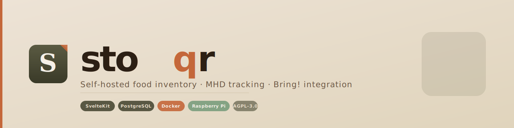

<div align="center">



<p>&nbsp;</p>

[](https://github.com/Labushuya/stoqr/actions/workflows/ci.yml)
[](https://github.com/Labushuya/stoqr/actions/workflows/docker-publish.yml)
[](https://github.com/Labushuya/stoqr/releases)
[](./LICENSE)
[](./docs/raspi-setup.md)
[](https://github.com/Labushuya/stoqr/pkgs/container/stoqr)
[](https://kit.svelte.dev/)
[](https://www.postgresql.org/)
[](https://orm.drizzle.team/)
[](https://www.getbring.com/)

</div>

---

## Was ist Stoqr?

Stoqr ist eine **self-hosted Web-App** zur Verwaltung von Lebensmitteln im Haushalt. Kein Cloud-Account, keine Abo-Kosten — läuft auf dem Raspberry Pi unter dem Schreibtisch, neben Pi-Hole und Traefik.

- Scanne Barcodes, bekomme Produktdaten automatisch aus Open Food Facts
- Behalte den Überblick über MHD — mit farbiger Ampelwarnung
- Verwalte Vorrat (Ist) und Bedarf (Soll) — Stoqr generiert daraus deine Einkaufsliste
- Schicke die Einkaufsliste direkt in **Bring!** — nach Markt gruppiert (Globus, Edeka, Lidl…)
- Alles bleibt auf deiner Hardware. Keine Daten in der Cloud.

---

## Features

| Feature | Status |
|---|---|
| 📍 Ortsverwaltung (Raum → Schrank → Fach) | Phase 1 |
| 📦 Artikel-Inventar (Barcode, Menge, MHD) | Phase 1 |
| 🚦 MHD-Ampel mit konfigurierbarer Toleranz | Phase 1 |
| 📷 Barcode-Scan via Kamera (ZXing, browser-nativ) | Phase 2 |
| 🔍 Open Food Facts Auto-Fill (Name, Nährwerte, Bild) | Phase 2 |
| 📝 OCR MHD-Erkennung via Kamera (Tesseract.js) | Phase 2 |
| 🥗 Dynamische Nährwertangaben (EAV, beliebig erweiterbar) | Phase 2 |
| 🛒 Vorrat/Bedarf-Delta → automatische Einkaufsliste | Phase 3 |
| 🏪 Markt-Zuordnung (Primär/Sekundär pro Artikel) | Phase 3 |
| 📲 Bring! Direktintegration (API, nach Markt gruppiert) | Phase 3 |
| 📴 PWA / Offline-Einkaufsliste | Phase 3 |
| 👥 Multi-User / Haushalt-Sharing | Phase 3 |

---

## Quick Start

### Voraussetzungen

- Docker & Docker Compose v2
- Traefik läuft bereits als Reverse Proxy (externes `proxy`-Netzwerk)
- Domain oder lokaler Hostname (z.B. via Pi-Hole: `stoqr.home.example.com`)

### 1. Klonen und konfigurieren

```bash
git clone https://github.com/Labushuya/stoqr.git
cd stoqr
cp .env.example .env
nano .env  # Pflichtfelder ausfüllen
```

Pflichtfelder in `.env`:

```env
DB_PASSWORD=sicheres_passwort
BETTER_AUTH_SECRET=$(openssl rand -base64 32)
DOMAIN=stoqr.home.example.com
ENCRYPTION_KEY=$(openssl rand -hex 32)
```

### 2. Starten

```bash
docker compose up -d
```

Stoqr ist jetzt unter `https://stoqr.home.example.com` erreichbar.

### 3. Datenbank migrieren

```bash
docker compose exec stoqr node -e "require('./build/migrate.js')"
```

### Auto-Updates mit Watchtower

```bash
docker run -d \
  --name watchtower \
  -v /var/run/docker.sock:/var/run/docker.sock \
  containrrr/watchtower \
  --interval 300 \
  --cleanup \
  stoqr
```

---

## Tech Stack

| Schicht | Technologie | Warum |
|---|---|---|
| Frontend | [SvelteKit 2](https://kit.svelte.dev/) | Geringster RAM-Footprint (~60 MB vs. 120 MB Next.js) |
| Styling | [Tailwind CSS 4](https://tailwindcss.com/) + [shadcn-svelte](https://www.shadcn-svelte.com/) | Minimalistisch, anpassbar |
| ORM | [Drizzle ORM](https://orm.drizzle.team/) | Reines TypeScript, kein ARM64-Binary-Problem |
| Auth | [Better Auth](https://www.better-auth.com/) | Single-User MVP, Multi-User nachrüstbar |
| Datenbank | [PostgreSQL 16 Alpine](https://www.postgresql.org/) | ARM64-nativ, kleinste Image-Größe |
| Barcode | [@zxing/browser](https://github.com/zxing-js/library) | Browser-WASM, kein Server-Roundtrip |
| Produkt-Lookup | [Open Food Facts API](https://world.openfoodfacts.org/) | Kostenlos, kein API-Key |
| Bring! | Inoffizielle REST API | Direkte Integration, keine Share-Umwege |
| Reverse Proxy | [Traefik v3](https://traefik.io/) | Docker-Labels, TLS automatisch |
| CI/CD | GitHub Actions + Buildx | ARM64 + AMD64 Multi-Arch |

**RAM-Verbrauch auf Pi 4:** ~550 MB gesamt (PostgreSQL ~80 MB + Stoqr ~100 MB + Traefik ~30 MB).

---

## Datenbankmodell

16 Tabellen in 10 logischen Modulen — vollständig dokumentiert in [`packages/db/src/schema.ts`](./packages/db/src/schema.ts):

```
users
  └── locations → storages → places        (Ortsverwaltung)
  └── inventory_items                       (Bestand, pro Packung)
  └── stock_targets                         (Soll-Bestand)
  └── shopping_list_items                   (Einkaufsliste)
  └── stores ← product_stores              (Märkte + Zuordnung)
  └── expiry_config                         (MHD-Ampel-Konfiguration)
  └── bring_sync_log                        (Bring! Sync-Protokoll)

products
  └── categories (hierarchisch)
  └── product_nutrients → nutrient_types   (EAV, dynamisch)

audit_log                                  (Änderungsprotokoll, via Trigger)
```

---

## Konfiguration

Alle Einstellungen über Environment Variables (`.env`):

| Variable | Pflicht | Beschreibung |
|---|---|---|
| `DATABASE_URL` | ✅ | PostgreSQL Connection String |
| `DB_PASSWORD` | ✅ | Datenbankpasswort |
| `BETTER_AUTH_SECRET` | ✅ | 32-Zeichen Zufalls-Secret (`openssl rand -base64 32`) |
| `BETTER_AUTH_URL` | ✅ | Öffentliche URL der App |
| `DOMAIN` | ✅ | Domain für Traefik-Label |
| `ENCRYPTION_KEY` | ✅ | 64-Hex AES-256 Key für Bring!-Credentials (`openssl rand -hex 32`) |
| `TZ` | | Zeitzone (default: `Europe/Berlin`) |
| `OFF_USER_AGENT` | | User-Agent für Open Food Facts (default: `stoqr/0.1.0`) |

---

## Raspberry Pi Setup

Vollständige Anleitung: **[docs/raspi-setup.md](./docs/raspi-setup.md)**

Behandelt: OS-Setup, Docker, Traefik, Pi-Hole DNS, Watchtower, Datenbank-Backups.

---

## Bring! Integration

Stoqr kommuniziert direkt mit der Bring! REST API:

1. Bring!-Zugangsdaten in den App-Einstellungen hinterlegen (werden AES-256 verschlüsselt gespeichert)
2. Pro Markt (Globus, Edeka, …) eine Bring!-Liste zuordnen
3. Einkaufsliste generieren → direkt in die jeweilige Bring!-Liste pushen — nach Markt gruppiert

---

## Entwicklung

```bash
git clone https://github.com/Labushuya/stoqr.git
cd stoqr
pnpm install
cp .env.example .env  # DATABASE_URL und Secrets anpassen

# Datenbank starten
docker compose -f docker-compose.dev.yml up postgres -d

# Migrationen ausführen
pnpm db:migrate

# Dev-Server
pnpm dev
```

Weitere Details: [CONTRIBUTING.md](./CONTRIBUTING.md)

---

## Lizenz

[AGPL-3.0](./LICENSE) — Nutzung und Selbst-Hosting erlaubt, Änderungen müssen als Open Source veröffentlicht werden.

---

<div align="center">

*Gebaut aus Frustration über abgelaufenen Joghurt. Läuft auf einem Pi unterm Schreibtisch.*

</div>
